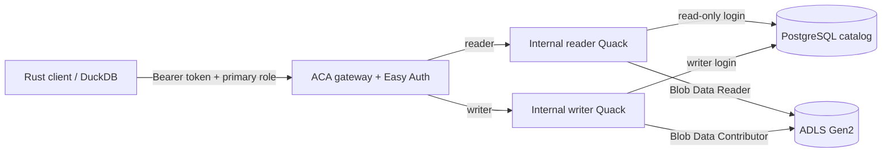

# Azure DuckLake Quack

An experimental Azure-native DuckLake service that keeps DuckDB's Quack
protocol intact and adds Microsoft Entra role selection at an HTTP gateway.
The implementation is Rust; the data plane remains DuckDB and DuckLake.

> Quack is experimental in DuckDB 1.5.x. This repository is a development
> preview, not a production security boundary. See the pinned compatibility
> contract and upstream limitation before deploying.

## What v0.1.0 provides

- PostgreSQL-backed DuckLake metadata and ADLS Gen2 Parquet storage.
- Separate Quack reader and writer processes with independent managed identities,
  PostgreSQL users, storage RBAC, and backend tokens.
- Container Apps Easy Auth at the only public ingress.
- Entra security groups mapped to `reader` and `writer` primary roles.
- A default `reader` role when the client omits role selection.
- A Rust device-code client that passes the Entra bearer token through Quack's
  supported `EXTRA_HTTP_HEADERS` option.
- Modular Bicep and a three-stage immutable-image deployment.
- An opt-in dbt Core 2 alpha Container Apps Job that publishes a Parquet source
  to ADLS, stages it, and incrementally merges it into DuckLake through the
  in-process DuckDB ADBC driver, with no Quack hop.
- An executable Linux integration spike using PostgreSQL 17, a stable DuckDB
  1.5.5 server, and a checksum-pinned official v1.5 preview client.

It does **not** implement Quack messages. The gateway streams opaque
`application/duckdb` HTTP bodies between the client and the selected Quack
backend.



## Role model

Role selection happens when a connection is created:

- No requested role means `reader`.
- `reader` requires membership in the deployment's reader group.
- `writer` requires membership in the deployment's writer group.
- Entra group overage or missing group claims fail closed.
- Roles cannot be switched inside an established Quack connection.

This is intentionally similar to selecting a Snowflake primary role. Secondary
roles are not part of v0.1.0; a new connection is required to select another
role.

## Query contract

The Rust client wraps SQL in Quack's server-side table function and selects the
server's attached `lake` catalog:

```sql
FROM quack_query('quack:gateway.example:443',
                 'USE lake; SELECT * FROM analytics.example',
                 token => '...');
```

The CLI constructs this call; users normally pass only `--query`. A normal
client-side `ATTACH` followed by direct scans is not supported for this
DuckLake topology because of upstream
[Quack issue #190](https://github.com/duckdb/duckdb-quack/issues/190). See
[docs/compatibility.md](docs/compatibility.md).

## Local quality gates

```bash
cargo fmt --all -- --check
cargo clippy --workspace --all-targets -- -D warnings
cargo test --workspace
shellcheck scripts/*.sh tests/spike/*.sh
az bicep build --file infra/main.bicep --stdout >/dev/null
docker build -f docker/gateway.Dockerfile .
docker build -f docker/runtime.Dockerfile .
docker build -f docker/client.Dockerfile .
docker build -f docker/dbt-spike.Dockerfile .
./tests/spike/quack-postgres.sh
```

## Azure deployment

The prepared development deployment targets Sweden Central and creates a new
resource group. Existing Azure or Entra objects are never adopted by name.

```bash
export AZURE_SUBSCRIPTION_ID=<subscription-id>
export AZURE_ENV_NAME=azdqdev
export AZURE_LOCATION=swedencentral

./scripts/prepare-env.sh
git add -A
git commit -m "Prepare release"
./scripts/deploy.sh
./scripts/verify-live.sh
```

`prepare-env.sh` creates two app registrations and two project-specific Entra
security groups, then adds the signed-in user to the newly created groups.
`deploy.sh` performs read-only collision/provider/SKU checks, provisions the
foundation, builds images in ACR, resolves their digests, creates and waits for
the bootstrap job, and only then creates the reader, writer, and gateway apps.
All local azd state is under the gitignored `.azure/` directory.

The separately gated dbt 2 spike is documented in
[docs/dbt-spike.md](docs/dbt-spike.md). Its deployment flag is false by default;
`scripts/deploy-dbt-spike.sh` builds an immutable image, provisions one manual
job in the existing environment, and waits for its Parquet-to-DuckLake build.

The quiet development baseline was estimated at roughly USD 36–45/month in
Sweden Central on 2026-08-15, before taxes, free grants, logs, storage, and
egress. PostgreSQL B1ms, its 32 GiB minimum storage, ACR Basic, and the always-on
reader account for most of it.

## Repository layout

- `crates/policy`: pure primary-role authorization policy.
- `crates/gateway`: Easy Auth principal parsing and opaque Quack proxy.
- `crates/runtime`: Rust supervisor for the official DuckDB/Quack process and
  idempotent bootstrap job.
- `crates/client`: device-code login and DuckDB CLI handoff.
- `infra`: subscription-scoped modular Bicep.
- `scripts`: guarded Entra, staged deployment, and verification workflows.
- `spikes/dbt`: contained dbt Core 2/DuckDB ADBC/DuckLake proof project.

## Security boundaries

The public gateway has no DuckLake, PostgreSQL, or Storage data permission.
Reader and writer identities receive only their own Key Vault secrets and
container-scoped Storage roles. The reader opens DuckLake with DuckDB's physical
read-only access mode in addition to its read-only PostgreSQL login and Blob
Data Reader role. PostgreSQL values enter DuckDB through its secret manager;
the secrets are temporary and memory-backed because DuckDB persistent secrets
are unencrypted on disk. Passwords are not embedded in connection URIs,
committed, passed on process command lines, or retained in the DuckDB child's
environment.

Known signed core extensions remain auto-install/autoload capable because
Quack's transient request connections must resolve the already-installed
DuckLake and PostgreSQL extensions. Setting
`autoinstall_known_extensions=false` currently makes Quack return HTTP 500, so
the images preinstall pinned extensions and the runtime blocks community and
unsigned extensions instead. The integration contract tests this exact setup.

PostgreSQL and Storage use public endpoints in v0.1.0 because Consumption ACA
does not provide stable outbound IPs without adding a VNet/NAT cost. Access is
still authenticated, TLS-protected, and least-privilege. A production profile
should add VNet integration and private endpoints.

Gateway requests have a 230-second upstream deadline so the service returns an
explicit failure before Container Apps' 240-second HTTP request limit. v0.1.0
therefore targets interactive queries shorter than that boundary; asynchronous
query execution is deferred.
